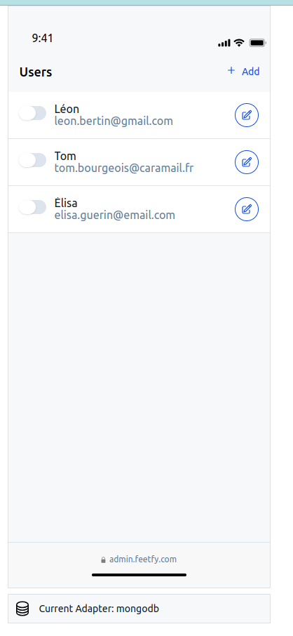
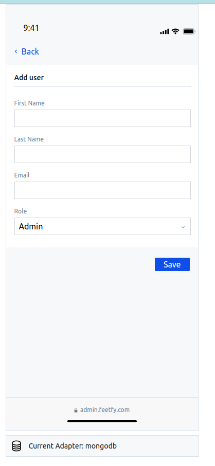
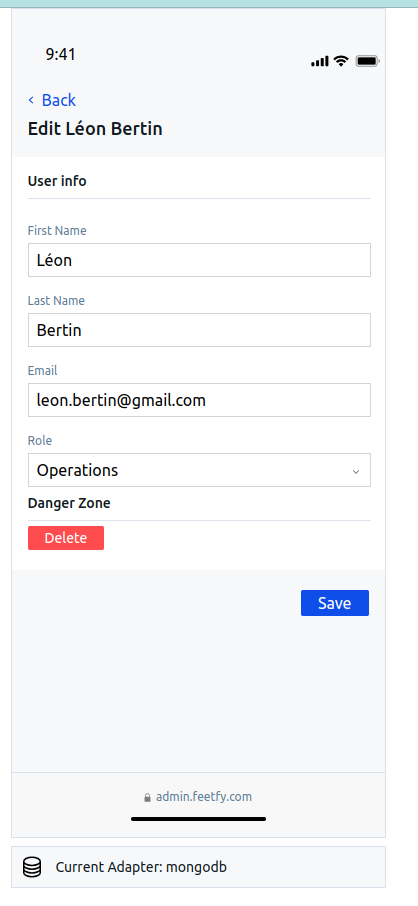
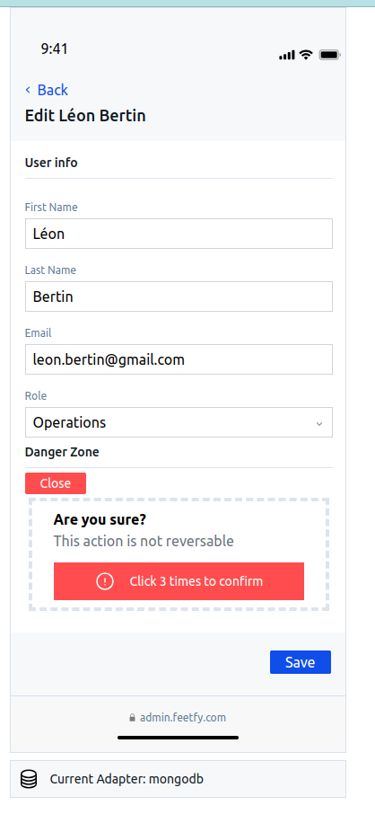

# Feefty Admin Test

## Approach

### Frontend
Globally was very fun, Nextjs has some astonishing features and it took me a while to understand how it actually works and how to use SSR effectively.
If it was just a React app I would have use just 1 page and handle everything in the frontend since the logic is straightforward.
But given the fact that SSR are not only very powerful but also very useful to avoid writing extra code.

Given this I create 3 pages:

1. *Home* (`PATH: "/"`) It's used for the list of the users to display. This page use SSR logic for fetching the user and the roles and also 
thanks, to server actions, it was possible to handle the logic of the user state change (the switch button on the left). In fact thanks to the

    ```
    <form action={actionName}>
    </form>
    ```
    It's possible to handle the form from the server, taking full advantage of cache update and server-side action. (At the beginning figuring out that this was possible was a bit difficult).

2. *Add User* (`PATH "/adduser"`) This page it's used to add a new user, in this case the form is a client component because it has logic that comes from the client. So the render of this page is mostly client side. But still it use a form tag has *Home* page and so the form is handled with a server action.

3. *Update User* (`PATH "/updateuser/[id]"`) This page is used instead to modify the user, the path is used to store the state of the current user to fetch, since this information is avaible at build time NextJs will handle everything from the server and so this is also partialy SSR (not the form of course because depends on client inputs), the action is the same of Add User because the component is the same.

In order to improve the usability of the interface I opted to use `useForm` and `zod`, I feel this combo very powerful to create robust and usable interfaces that reduce user erros at the minimum. In this phase a big challenge for me was not only NextJs that in the end simplify most of the things you have to do (at least for server side communication) but also TailWind (that I now like a lot) was not so easy to undestand at the beginning and I feel that the actual code can be simplified. 

> Note: I took the freedom to add at the end of the interface a div that show which adapter is used at the moment, it's not part of the design but its' just used to show how the backend works. 

### Backend

In order to fit the Clean Architecture (or Orthogonal architecture) I use dependency injection in order to create 2 different Adapters (one for prisma and another for mongo). In the adapters there are all the details of the communication and interaction with the database, this is the part of the architecture that hide any implementation details of retriving the files. In fact in the example the functions related to mongodb are different from the one in prisma in which the data shape is different. 
The common things about all the adapters are the functions that they expose, those are the one that realize the interface.
The other part of the clean architecture is in the `action.js` file, here we have the same functions names of the adapters, this file is conceptually the **Port**. The **Port** is the part that separate the input and his shapes in the frontend from the particular way in which the input is store in the backend by refering to the particular Adapter and calling the function like this:

```javascript
const adapter = PrismaAdapter 
export async function getUsers() {
    const users = await adapter.getUsers() // here the adapter is used (Dependency Injection)
    return users || []
}
```

This is just a simple example to show how this architecture is used, other level of abstraction are possible in particular when there is a real business logic to implement (in this case it's just a CRUD interface).

#### Tests

I make some tests in the single component but I was not able to mock `useRouter` of `next/navigation`. I tried in multiple ways (`next-router-mock` but was not working and, neither creating the mock manually) but in the end does not work, anyway i left an idea on how to test such a component. 

### How to Run the example

1. Run with Prisma Adapter:
```
# Run database (ex with docker)
docker pull postgres

docker run --name feefty-db -e POSTGRES_USER=user -e POSTGRES_DB=prova  -e POSTGRES_PASSWORD=prova -d -p 5432:5432 postgres
```
Reuse this credentials in the `.env` file

```
npm run dev
```

2. Run with Mongo Adapter
```
# Run database (ex with docker)
docker pull mongodb
docker run -d -p 27017:27017 --name mongodb mongo

cd ./lib/mongo
node seed.js
```

Now change line 10 of the adapter to use Mongo Adapter, everything should work correctly.

### Output and result
You can find a video demonstration of the application working.











